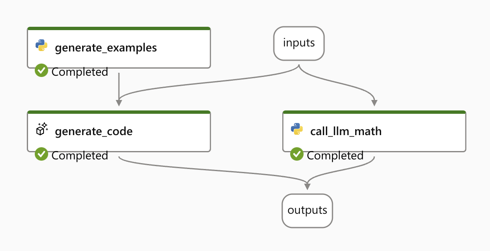

# A simple flow that uses LangChain LLMMathChain
[Portal link](https://eastus2euap.ml.azure.com/prompts/flow/5fbfda62-4e3d-43da-b908-8b8feca82b17/26f462a2-4622-423a-bb7c-01f2cd8945f9/details?wsid=/subscriptions/96aede12-2f73-41cb-b983-6d11a904839b/resourceGroups/promptflow/providers/Microsoft.MachineLearningServices/workspaces/promptflow-canary&flight=promptflow&tid=72f988bf-86f1-41af-91ab-2d7cd011db47)

It looks like:

